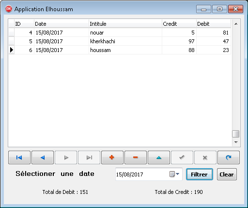

# Delphi_SimpleApp

## This repos contain one simple app:

## Functionality

- retrieve information from DB 'MySql5.1'
- Sorting them by clicking on the column
- Apply Filter on date 
- Sum all Debit and Credit, when you apply the filter

devoloped Using Delphi XE5 et Mysql 5.1

its was for a job offre, i did applied for on [Offre](https://naltis.com/exercice_soft.pdf)
